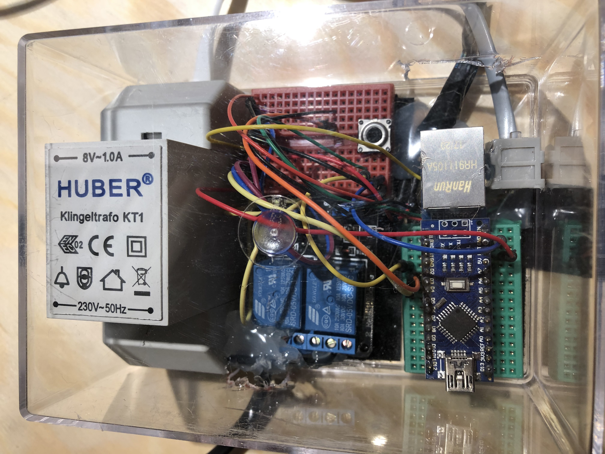

# Arduino Door Bell

Features - Garden Door Part

- button glows in warm white
- button shines in bright green if pressed
- operates independent of backend (only with 5V power supply)

Features - In House / Backend Part

- button press detection (debounced)
  - post http request to inform smart home system
  - switch relay to power up the transformer
    - transformer creates 8V to drive the ring mechanism

## Overview Diagram

## The final package

Thank you for providing these libraries:

- Debouncing: https://github.com/thomasfredericks/Bounce2
- Ethernet for ENC28J60: https://github.com/njh/EtherCard

